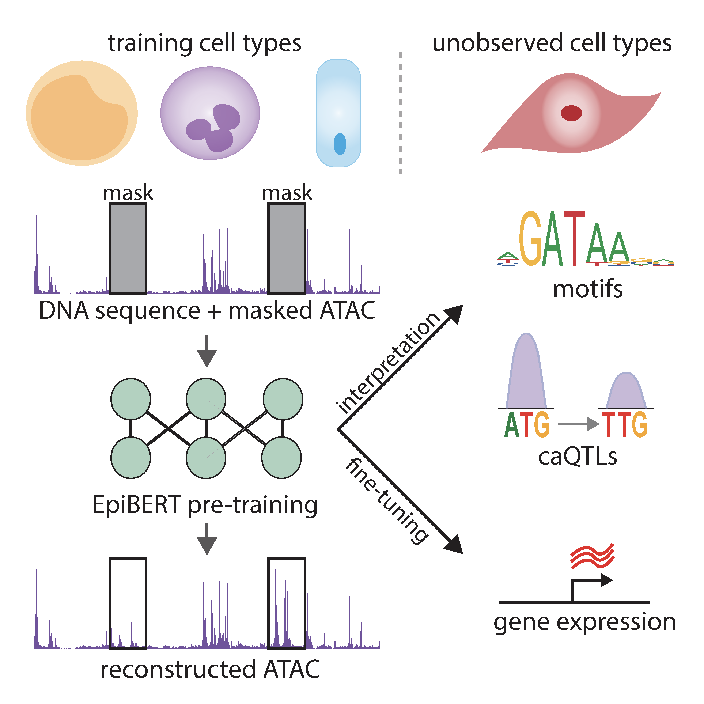

## EpiBERT


**EpiBERT** learns representations of accessible sequence that generalize across cell types via "masked accessibility modeling" which can be used for downstream fine-tuning tasks, such as caQTL predictions and RAMPAGE-seq prediction in new cell types. [Link to manuscript](https://www.cell.com/cell-genomics/fulltext/S2666-979X(25)00018-7)

If you use EpiBERT or the code in this repository please cite Javed, N.<sup>\*</sup>, Weingarten, T.<sup>\*</sup>, Sehanobish, A., Roberts, A., Dubey, A., Choromanski, K., and Bernstein, B.E. (2025). A multi-modal transformer for cell type-agnostic regulatory predictions. Cell Genom. 5, 100762. DOI: 10.1016/j.xgen.2025.100762. 

### Installation
This repository depends on Python 3 and Tensorflow. See all requirements which you can see and install via requirements.txt for pip. For ease you can clone this repository and run set pip install -e .

### Model Usage
These notebooks are a work in progress. I will be adding notebooks for variant scoring w/ null distribution, motif generation, and RAMPAGE-seq/QTL prediction shortly. If there is a task in particular you would like please post it as an issue. 
- [Data preprocessing for model usage](example_usage/data_processing.ipynb)
- [caQTL scoring and plotting ](example_usage/caqTL_predict.ipynb)

### Data Availability
The data for EpiBERT can be found at gs://epibert/data and [here](https://storage.googleapis.com/epibert/data/). The dataset is multiple TB in size and therefore we have turned on the 'requester pays' option in Google Cloud. To access the data you can use the [gsutil](https://cloud.google.com/storage/docs/gsutil) command line and provide a valid GCP billing account. Some sample commands are provided below. Note that transferring and listing data using gsutil does incur a cost. Relevant information can be found [here](https://cloud.google.com/storage/pricing). It is a good idea to estimate the total cost of a transfer based on the destination region and the total amount of data prior to initiating a significant data transfer. Datasets are in tensorflow record format - functions for reading/deserializing/decoding this data are available in the scripts described in 'main_files' directory below. 

#### gsutil example commands
To list the total size of the atac pretraining dataset (~4 TB) you can use: 
```sh
gsutil -u billing-project-id du -sh gs://epibert/data/atac_pretraining/train
```

To download a single file to your current working directory: 
```sh
gsutil -u billing-project-id cp gs://epibert/data/atac_pretraining/train/Ductal.tfr .
```

To copy the whole fine tuning data directory to a destination bucket
```sh
gsutil -u billing-project-id -m cp -r gs://epibert/data/rampage_fine_tuning gs://destination-bucket/ .
```

The dataset is structured as below: 

ATAC pre-training data
 - training data: gs://epibert/data/atac_pretraining/train
 - validation data (18 validation cell-types + 2160 validation sequences): gs://epibert/data/atac_pretraining/valid
 - testing data (~40k centered windows on peaks + background negative regions in the 1840 testing regions):
   - 16 testing cell-types + testing regions: gs://epibert/data/atac_pretraining/test/testing_celltypes
   - 15 training cell-types + testing regions: gs://epibert/data/atac_pretraining/test/training_celltypes
 
 Fine-tuning data
 - training data (50 paired ATAC-RAMPAGE datasets for training cell-types over 34021 training sequences): gs://epibert/data/rampage_fine_tuning/train
 - validation data (50 paired ATAC-RAMPAGE datasets for training cell-types over 2160 validation sequences): gs://epibert/data/rampage_fine_tuning/train
 - testing data (1731 TSS centered and 1840 non-TSS centered regions over the 50 paired ATAC-RAMPAGE datasets for training cell-types and 8 paired datasets for testing cell-types).

### Model Weights
 - Two pre-trained models are available at gs://epibert/models/pretrained. Both models are used for caQTL analyses. Only model1 was used for downstream fine-tuning.
 - The fine-tuned model for RAMPAGE-seq prediction is available at gs://epibert/models/fine_tuned
 - Models are also available for download/access on tfhub/Kaggle at https://www.kaggle.com/nmjaved/models. 

### Dataset Processing (to clean up)
Scripts and code for dataset processing can be found in the data_processing directory.
 * alignment_and_peak_call : ATAC-seq alignment and peak calling
 * create_signal_tracks : 
    * bam_to_bed_RAMPAGE_5PRIME.wdl - convert RAMPAGE-seq bam to fragment bed file containing locations of mapped TSS, and then convert to scaled bedGraph signal file
    * bam_to_bed_ATAC.wdl - convert ATAC-seq bam to fragments file
    * liftover_fragments.wdl - convert hg19 fragments files from CATLAS to hg38 given the required input chain file
    * fragments_to_bed_scores.wdl - convert input fragments files corresponding to tn5 cut sites to scaled bedGraph signal file

 * downloading utilities : download fastqs from GEO or processed bams from ENCODE
 * motif_enrichment : compute motif enrichments of consensus motifs from Vierstra et. al 2020 using MEME simple enrichment analysis (SEA)
 * write_TF_records : convert input ATAC and RAMPAGE profiles, and motif enrichments to tfrecords. Also contains all the train/validation/test sequence splits in sequence_splits subdirectory. 


### Training
For pre-training(masked atac prediction, _atac suffix files):
 * execute_pretraining.sh - training bash script where you can define dataset locations, weights and biases username and project id, and model hyperparameters
 * training_utils_atac_pretrain.py - define functions for train and validation steps, data loading and augmentation, masking, early stopping, model saving
 * train_model_atac_pretrain.py - define main training loop, argument parsing, wandb initialization code, TPU initialization code
 * src/models/epibert_atac_pretrain.py - main model file
 * src/layers/layers.py - all custom layers
 * src/layers/snnk_attention.py - linear attention code with rotary positional encodings

Files for fine-tuning for RAMPAGE prediction follow a similar structure


